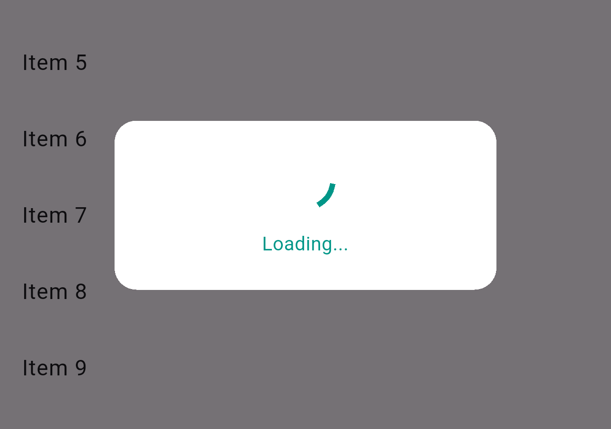
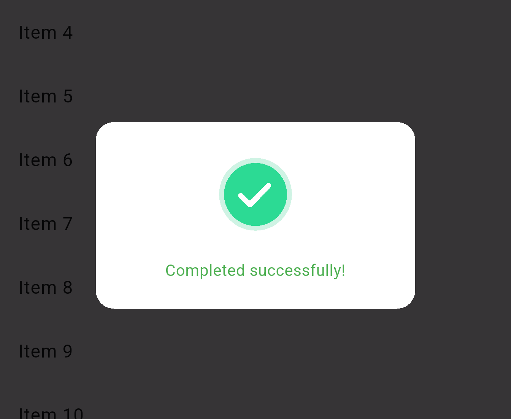
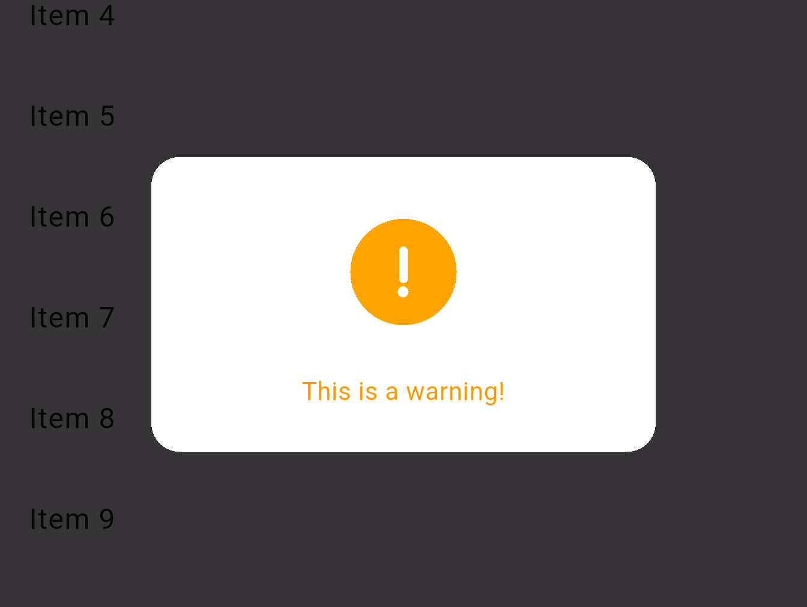
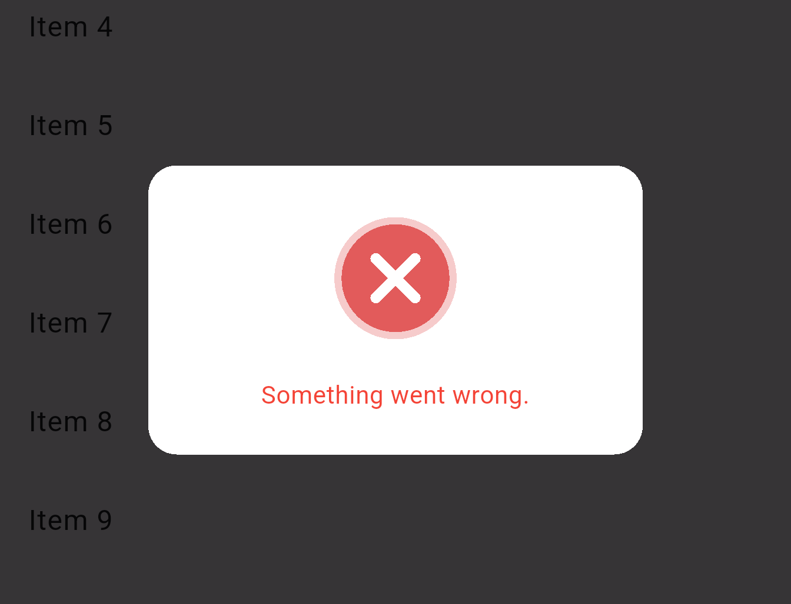
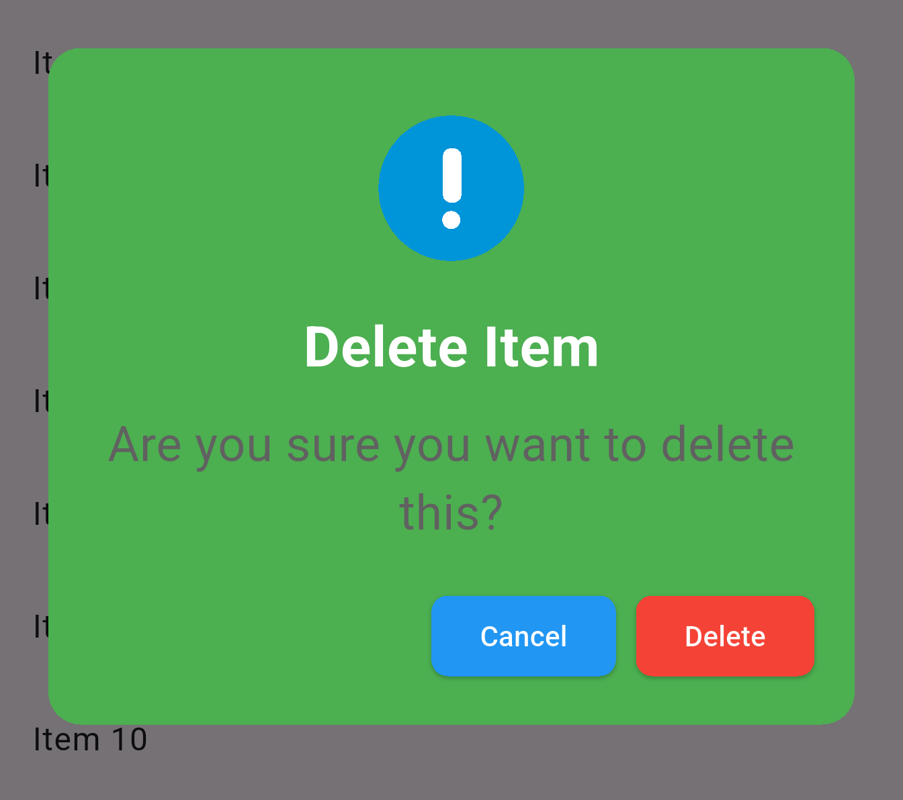
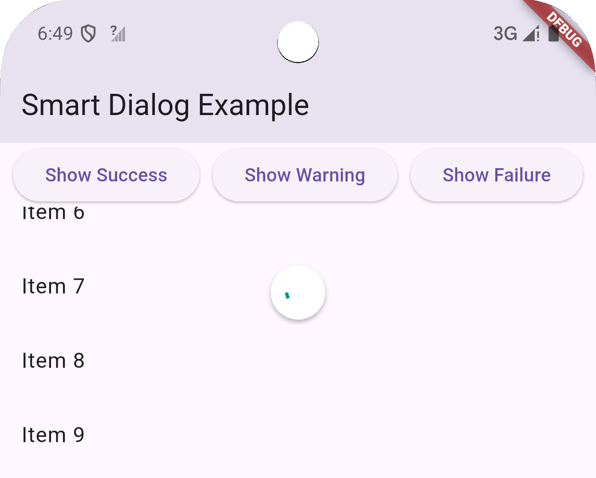
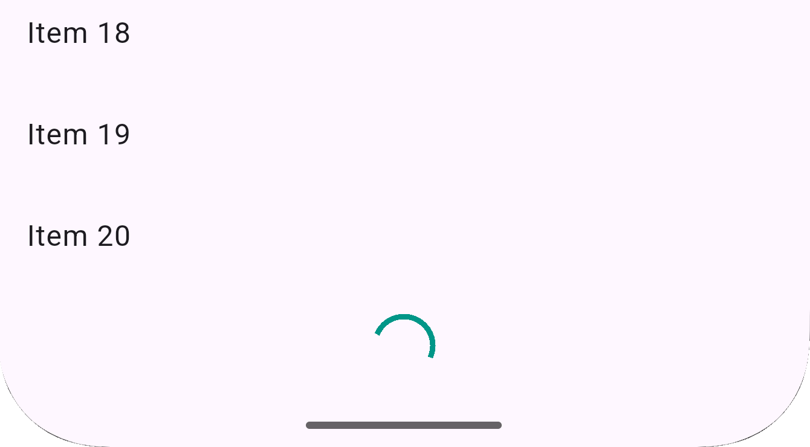

# Smart Dialogs Plus

**Smart Dialogs Plus** is a complete Flutter UI feedback toolkit that combines animated dialogs, alerts, snackbars, pull-to-refresh indicators, and infinite scroll loaders. Built for modern apps that value clean, intuitive, and reactive feedback for every user interaction.

---

## ✨ Features

* ✅ `SmartProgressDialog` with animations for loading, success, failure, and warning states
* ⚠️ `SmartAlertDialog` for confirmations, info, and warnings
* 🍞 `SmartSnackBar` for toast-like user feedback with flexible placement
* 🔁 `SmartRefreshIndicator` to wrap scroll views with pull-to-refresh
* 📆 `SmartListLoader` to append a loader during infinite scroll
* 🎮 `SmartProgressController` to manage dialog state transitions programmatically
* 🎨 Full customization of color, message, placement, and icons

---

## 🚀 Installation

Add to your `pubspec.yaml`:

```yaml
dependencies:
  smart_dialogs_plus: ^0.0.7
```

Import into your Dart files:

```dart
import 'package:smart_dialogs_plus/smart_dialogs_plus.dart';
```

---

## ✅ Tests

Smart Dialogs Plus includes complete widget and unit tests for the following:

- SmartProgressController
- SmartAlertDialog
- SmartListLoader
- SmartProgressDialog
- SmartRefreshIndicator
- SmartSnackBar

To run tests:

```bash
flutter test
```

---

## 🧠 Usage

### 1. Show Progress Dialog with Controller

```dart
final controller = SmartProgressController();
controller.attach(context);

controller.showLoading("Please wait...");
await Future.delayed(Duration(seconds: 2));
controller.showSuccess("All done!");
```

---

### 2. Inline Progress Dialog

```dart

SmartAlertDialog.show(
    context, // Build context
    title: "Alert Title", // Custom title
    titleFontSize: 28, // Custom title font size
    message: "Alert message goes here.", // Custom message
    messageFontSize: 24, // Custom message font size
    type: SmartAlertType.warning, // Alert type: warning, error, success, info
    loopAnimation: false, // Enable/disable looping animation
    onConfirm: () {
      // Handle confirmation
    },
    alertDialogTheme: SmartAlertDialogTheme( // Custom theme for the alert dialog
        backgroundColor: Colors.white, // Background color
        titleTextColor: Colors.black, // Title text color
        messageTextColor: Colors.grey, // Message text color
        buttonsBorderRadius: BorderRadius.circular(8), // Button border radius
        confirmButtonTextColor: Colors.white, // Confirm button text color
        confirmButtonBackgroundColor: Colors.blue, // Confirm button background color
        cancelButtonTextColor: Colors.white, // Cancel button text color
        cancelButtonBackgroundColor: Colors.red, // Cancel button background color
    }
);
```

---

### 3. Show Alert Dialog

```dart
SmartAlertDialog.showDialog(
    context, { // Build context
    title: "Alert Title", // Custom title
    titleFontSize: 28, // Custom title font size
    message: "This is an alert message.", // Custom message
    messageFontSize: 24, // Custom message font size
    type: SmartAlertType.info, // Alert type: info, warning, error, success
    onConfirm: () { // Optional callback for confirm action
      // Handle confirmation
    },
    onCancel: () { // Optional callback for cancel action
      // Handle cancellation
    },
    confirmText: "OK", // Custom button texts
    cancelText: "Cancel", // Custom button texts
    showCancel: true, // Show cancel button
    color: Colors.blue, // Custom color for the dialog
    barrierDismissible: true, // Allow dismissing by tapping outside
    animateAsset: true, // Show animated asset
    loopAnimation: true, // Loop the animation
);

```

---

### 4. Show Custom Snack bar

```dart
BuildContext context,
    String message, {
String? title,
SmartSnackBarType type = SmartSnackBarType.success,
SmartSnackBarDuration duration = SmartSnackBarDuration.short,
Color? backgroundColor,
SmartSnackBarPosition position = SmartSnackBarPosition.bottom,
bool showIcon = true,
IconData? customIcon,
bool showCloseIcon = false,
Color closeIconColor = Colors.white,
SnackBarClosedReason? Function()? onClose,


SmartSnackBar.show(
    context, message, {
    title: "Hello Title!",
    type: SmartSnackBarType.success,
    duration: SmartSnackBarDuration.short, // Duration of the snack bar: short, long, or indefinite
    backgroundColor: Colors.green, // Custom background color
    position: SmartSnackBarPosition.top, // Position of the snack bar: top or bottom
    showIcon: true, // Show icon based on type
    customIcon: Icons.check_circle, // Custom icon if showIcon is true
    showCloseIcon: false, // Show close icon
    closeIconColor: Colors.white, // Color of the close icon
    onClose: () { // Optional callback when snack bar is closed
      // Handle close
    },
    action: SnackBarAction( // Optional action button
    label: "Undo",
        onPressed: () {
        // Handle action
        },
    ),
);
```

---

### 5. Load More in Infinite Scroll List

```dart
SmartListLoader(isLoading: isLoadingMore)
```

---

### 6. Pull to Refresh Integration

```dart
SmartRefreshIndicator(
  onRefresh: _refreshData,
  child: ListView.builder(...),
)
```

---

## 📂 File Structure

```bash
lib/
├── smart_dialogs_plus.dart             # Export entry
└── src/
    ├── smart_alert_dialog.dart         # Alert dialog with confirm/cancel
    ├── smart_progress_dialog.dart      # Animated progress feedback
    ├── smart_snack_bar.dart            # Flexible snackbar
    ├── smart_refresh_indicator.dart    # Pull to refresh wrapper
    ├── smart_list_loader.dart          # Infinite scroll loader
    ├── smart_progress_controller.dart  # Controller
    └── enums.dart               # Enum of states
```

---

## 📸 Screenshots

| Type      | Preview                        |
| --------- | ------------------------------ |
| Loading   |    |
| Success   |    |
| Warning   |    |
| Error     |      |
| Snackbar  |   |
| Alert     |      |
| Refresh   |    |
| Load More |  |

---

## 📄 License

MIT License © 2025 Akika Digital

---

## 💡 Contributing

Got ideas for more widgets or improvements? Submit an issue or pull request on GitHub. Let’s make feedback in Flutter apps smarter — together!

---
