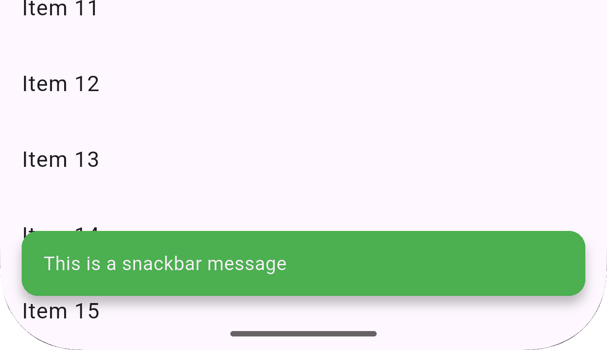

# Smart Dialogs Plus

**Smart Dialogs Plus** is a complete Flutter UI feedback toolkit that combines animated dialogs, alerts, snackbars, pull-to-refresh indicators, and infinite scroll loaders. Built for modern apps that value clean, intuitive, and reactive feedback for every user interaction.

---

## ✨ Features

* ✅ `SmartProgressDialog` with animations for loading, success, failure, and warning states
* ⚠️ `SmartAlertDialog` for confirmations, info, and warnings
* 🍞 `SmartSnackBar` for toast-like user feedback with flexible placement
* 🔁 `SmartRefreshIndicator` to wrap scroll views with pull-to-refresh
* 📆 `SmartListLoader` to append a loader during infinite scroll
* 🎮 `SmartProgressController` to manage dialog state transitions programmatically
* 🎨 Full customization of color, message, placement, and icons

---

## 🚀 Installation

Add to your `pubspec.yaml`:

```yaml
dependencies:
  smart_dialogs_plus: ^0.0.9
```

Import into your Dart files:

```dart
import 'package:smart_dialogs_plus/smart_dialogs_plus.dart';
```

---

## ✅ Tests

Smart Dialogs Plus includes complete widget and unit tests for the following:

- SmartProgressController
- SmartAlertDialog
- SmartListLoader
- SmartProgressDialog
- SmartRefreshIndicator
- SmartSnackBar

To run tests:

```bash
flutter test
```

---

## 🧠 Usage

### 1. Show Smart Loading Progress Dialog

```dart

SmartProgressDialog.showProgressDialog(
  context, // BuildContext
  color: Colors.black87, // Color of the progress dialog
  text: "Loading...", // Text to display in the dialog
);
```

---

### 2. Dismiss Smart Progress Dialog

```dart

SmartProgressDialog.dismissProgressDialog(
  context, // BuildContext
  SmartProgressState.success, // State of the dialog (success, error, warning)
  text: "Successful", // Text to display in the dialog
);

```
---

### 3. Show Smart Alert Dialog

```dart

SmartAlertDialog.show(
    context, // BuildContext
    title: "Delete Item", // Title of the dialog
    titleFontSize: 28, // Font size for the title
    message: "Are you sure you want to delete this?", // Message to display
    messageFontSize: 24, // Font size for the message
    iconType: SmartAlertIconType.info, // Type of icon to show (info, warning, success, error)
    animateAsset: true, // Whether to animate the icon
    loopAnimation: false, // Whether to loop the animation
    barrierDismissible: true, // Whether to dismiss the dialog on tapping outside
    confirmText: "Delete", // Text for the confirm button
    showCancel: true, // Whether to show the cancel button
    cancelText: "Cancel", // Text for the cancel button
    alertDialogTheme: SmartAlertDialogTheme( // Custom theme for the dialog
        buttonsBorderRadius: BorderRadius.circular(8), // Border radius for buttons
        backgroundColor: Colors.green, // Background color of the dialog
        titleTextColor: Colors.white, // Color of the title text
        messageTextColor: Colors.grey[700], // Color of the message text
        confirmButtonTextColor: Colors.white, // Color of the confirm button text
        confirmButtonBackgroundColor: Colors.red, // Background color of the confirm button
        cancelButtonTextColor: Colors.white, // Color of the cancel button text
    ),
    onConfirm: () {
        // Handle confirm action
    },
    onCancel: () {
        // Handle cancel action
    }
);

```

---


### 4. Show Smart Infinite Scroll List Loader

```dart
SmartListLoader(isLoading: isLoadingMore)
```

### 4. Show Smart Pull to Refresh

```dart
SmartRefreshIndicator(
  onRefresh: _refresh,
  child: ListView(...),
)
```

---


### 6. Show Smart Snack bar

```dart
SmartSnackBar.show(
    context, message, {
    title: "Hello Title!",
    type: SmartSnackBarType.success,
    duration: SmartSnackBarDuration.short, // Duration of the snack bar: short, long, or indefinite
    backgroundColor: Colors.green, // Custom background color
    position: SmartSnackBarPosition.top, // Position of the snack bar: top or bottom
    showIcon: true, // Show icon based on type
    customIcon: Icons.check_circle, // Custom icon if showIcon is true
    showCloseIcon: false, // Show close icon
    closeIconColor: Colors.white, // Color of the close icon
    onClose: () { // Optional callback when snack bar is closed
      // Handle close
    },
);
```

---

### 7. Show Smart Load More in Infinite Scroll List

```dart
SmartListLoader(isLoading: isLoadingMore)
```

---

### 8. Show Smart Pull to Refresh

```dart
SmartRefreshIndicator(
  onRefresh: _refreshData,
  child: ListView.builder(...),
)
```

---

## 📂 File Structure

```bash
lib/
├── smart_dialogs_plus.dart             # Export entry
└── src/
    ├── smart_alert_dialog.dart         # Alert dialog with confirm/cancel
    ├── smart_progress_dialog.dart      # Animated progress feedback
    ├── smart_snack_bar.dart            # Flexible snackbar
    ├── smart_refresh_indicator.dart    # Pull to refresh wrapper
    ├── smart_list_loader.dart          # Infinite scroll loader
    ├── smart_progress_controller.dart  # Controller
    └── enums.dart               # Enum of states
```

---

## 📸 Screenshots

| Type      | Preview                        |
| --------- | ------------------------------ |
| Loading   |    |
| Success   |    |
| Warning   |    |
| Error     |      |
| Snackbar  |   |
| Alert     |      |
| Refresh   |    |
| Load More |  |

---

## 📄 License

MIT License © 2025 Akika Digital

---

## 💡 Contributing

Got ideas for more widgets or improvements? Submit an issue or pull request on GitHub. Let’s make feedback in Flutter apps smarter — together!

---
